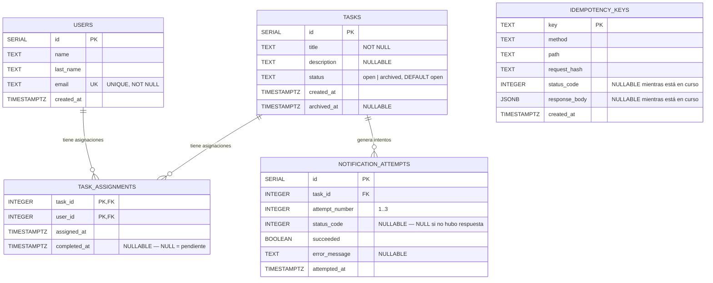

# UML de la base de datos — Reto GEEST

## Notas de diseño

- **`task_assignments`** es la tabla puente (N:M) entre `users` y `tasks`. Su clave primaria compuesta `(task_id, user_id)` evita asignaciones duplicadas a nivel de base de datos (respaldando el `ON CONFLICT DO NOTHING` de la capa de aplicación).
- **`completed_at IS NULL`** representa "pendiente"; al completarse se setea con `now()`. La tarea se archiva cuando `count(*) = count(completed_at)` para ese `task_id`.
- **`notification_attempts`** no tiene relación con `idempotency_keys`: son mecanismos de confiabilidad independientes (uno para reintentos salientes, otro para requests entrantes duplicados).
- **`idempotency_keys`** no tiene FK hacia otras tablas a propósito: debe poder registrar la clave antes de saber a qué recurso terminará apuntando la operación.

El script SQL versionado y ejecutable está en [`migrations/001_init.sql`](../migrations/001_init.sql).
